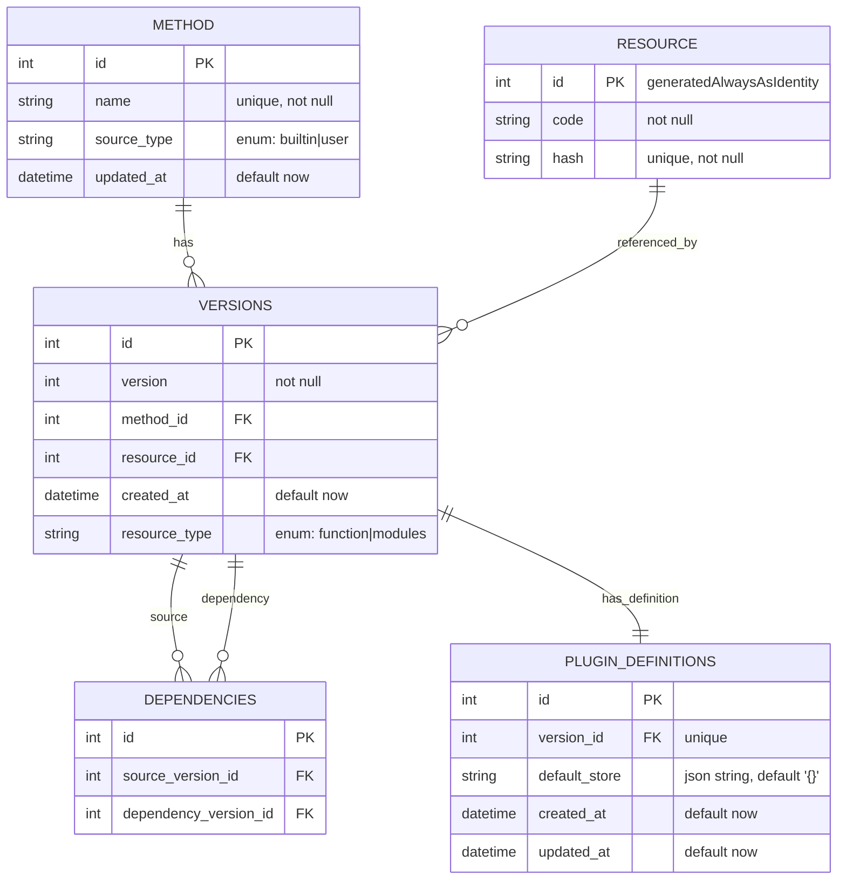

# Function Storage — ER Diagram

:::info
this doc is generated by AI
:::

This file contains an English ER diagram for the `function_storage` schema.

Notes:

- versions links to method and resource via foreign keys.
- dependencies models a semantic dependency: depends on a `method` plus a `version_constraint`.
- resolved_version_id can optionally pin to a concrete `versions.id` (cache).
- plugin_definitions is one-to-one with versions (unique version_id).
