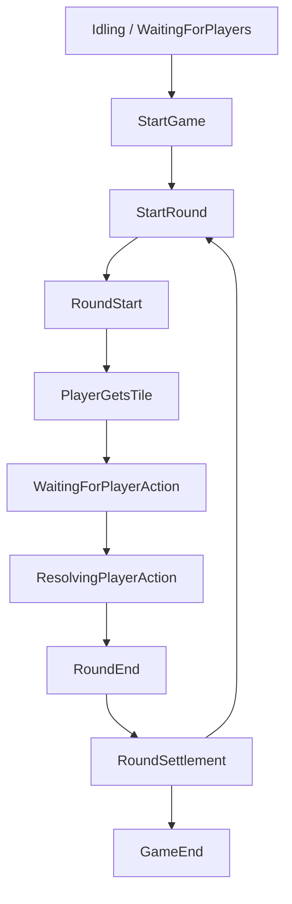

# 遊戲完整流程執行文檔

此文件描述目前 `modules/utils/src/game/index.ts` 與 `modules/utils/src/mahjong/type.ts` 中的遊戲執行流程，包含 Lobby、Game、Round 三層狀態，以及每個狀態在現有程式中的實際行為與後續應接的處理方式。

## 1. 核心資料與責任

### 1.1 `Game`
`Game` 是整體流程控制器，負責：
- 管理玩家加入與移除
- 推進回合狀態
- 維護 `requestId`，避免舊請求覆蓋新狀態
- 管理 timeout 與玩家回覆
- 呼叫 `Table` 與 `Player` 更新資料

### 1.2 `Table`
`Table` 負責桌面層資料：
- 牌堆 `tiles`
- 玩家摸到但尚未處理的牌 `playersDrawedTiles`
- 玩家已使用牌 `playersUsedTiles`
- 玩家操作紀錄 `playersActionTiles`
- 紅寶牌與裏寶牌

### 1.3 `Player`
`Player` 負責單一玩家手牌與個人狀態：
- `handTiles`
- `usedTiles`
- 抽牌、棄牌、移除手牌等操作

### 1.4 `requestId`
`Game.next()` 每次推進後都會產生新的 `requestId`。
這代表：
- 任何外部回呼都必須帶正確的 `requestId`
- 舊的回呼會被拒絕
- 可避免非同步或延遲回覆污染新一輪狀態

## 2. 三層狀態機

### 2.1 Lobby 狀態：`MahjongGameLobbyStatus`
定義於 [type.ts](../src/mahjong/type.ts)。

- `WaitingForPlayers`
  - 等待玩家加入
  - 對應 `Game.addPlayer()` 邏輯
- `GameInProgress`
  - 遊戲進行中
  - 一旦開始回合後應進入此狀態
- `GameEnded`
  - 整局遊戲結束
  - 不再接受新玩家或回合推進

目前程式尚未在 `Game` 類別中完整實作 lobby 狀態欄位，但文件上它代表最外層生命週期。

### 2.2 Game 狀態：`MahjongGameStatus`
定義於 [type.ts](../src/mahjong/type.ts)。

- `Idling`
  - 空閒中
  - 尚未開始遊戲
- `StartGame`
  - 進入遊戲初始化階段
  - 應做牌堆與玩家初始化
- `StartRound`
  - 開始某一局回合
  - 應進入 `MahjongGameRoundStatus.RoundStart`
- `RoundSettlement`
  - 回合結算
  - 計分、流局、和牌結果整理
- `RoundEnd`
  - 當局回合已結束
- `GameEnd`
  - 全局結束
  - 不再推進下一局

目前 `Game` 類別內主要是 round 狀態機，`MahjongGameStatus` 屬於更高層的流程預留。

### 2.3 Round 狀態：`MahjongGameRoundStatus`
定義於 [type.ts](../src/mahjong/type.ts)。

- `RoundStart`
  - 回合初始化
- `PlayerGetsTile`
  - 當前玩家摸牌
- `WaitingForPlayerAction`
  - 等待玩家出牌或其他玩家反應
- `ResolvingPlayerAction`
  - 正在處理玩家回覆
- `RoundEnd`
  - 本局回合結束，準備結算或開下一局

這是目前 `Game` 類別真正使用的狀態機。

## 3. 完整執行流程

## 4. 目前實作中的實際流程

### 4.1 加入玩家
`Game.addPlayer(playerId)`：
- 只能在 `RoundStart` 狀態下加入
- 若玩家重複則拋錯
- 會同步加入 `Table`

### 4.2 開始回合
`Game.handleRoundStart()`：
- 驗證目前必須處於 `RoundStart`
- 驗證玩家數不能為 0
- 將玩家 ID 洗牌後建立本回合順序
- 將 `currentPlayerIndex` 歸零
- 將 round 狀態改為 `PlayerGetsTile`
- 立刻呼叫 `next()` 推進到下一段流程

### 4.3 玩家摸牌
`Game.handlePlayerGetsTile()`：
- 取得當前玩家 ID
- 從牌堆取出索引 0 的牌
- 加入該玩家的摸牌紀錄
- 呼叫 `checkPlayerActionType()` 判斷是否存在可反應動作
- 如果可胡牌：
  - 寫入 `pendingPlayerActions`
  - 寫入 timeout 預設動作
  - 狀態切到 `WaitingForPlayerAction`
  - 啟動 timeout
- 如果沒有額外動作：
  - 狀態切到 `WaitingForPlayerAction`
  - 呼叫 `next()`，等待外部事件推進

### 4.4 等待玩家回覆
`MahjongGameRoundStatus.WaitingForPlayerAction`：
- 這個狀態本身不主動推進
- 目前設計是由遊戲伺服器收到玩家回覆後，再透過 gRPC 或 `next({ requestId, args })` 進來
- 若沒有玩家回覆，timeout 會介入執行預設動作

這裡的重點是：
- `Game` 不輪詢玩家
- `Game` 只接受外部事件
- 外部伺服器負責把玩家操作整理成 `args`

### 4.5 逾時處理
`Game.handleTimeoutAction()`：
- 找出所有還沒回覆的玩家
- 根據 `pendingPlayerDefaultActions` 決定預設動作
- 目前支援的預設動作是：
  - `TimeoutAction.Skip`
  - `TimeoutAction.DrawTile`

`TimeoutActionEvent` 目前支援帶 payload：
- `index`
- `tile`

這是為了讓需要參數的事件也能以同一種結構傳遞。

### 4.6 玩家回覆處理
`Game.handleResolvingPlayerAction()`：
- 先清掉 timeout
- 驗證玩家動作是否屬於允許清單
- 寫入 `resolvedPlayerActions`
- 檢查是否所有玩家都已回覆
- 若還有人未回覆，維持等待
- 若全數回覆完畢，逐一處理動作結果

目前動作處理分支的意義如下：
- `Tsumo`
  - 自摸和牌
  - 應直接進入結算
- `DiscardTile`
  - 出牌
  - 應把摸牌從手牌移除並更新棄牌區
- `Ron`
  - 榮和
  - 應中止其他反應並進入結算
- `Chi`
  - 吃
  - 應驗證位置與牌型，再更新副露與手牌
- `Pon`
  - 碰
  - 應驗證三張同牌，再要求補打一張
- `Kan`
  - 槓
  - 應依明槓、暗槓、加槓分支處理

### 4.7 回合結束
`Game.handleRoundEnd()`：
- 清掉 timeout
- 清空 pending / resolved 狀態
- 將 `currentPlayerIndex` 進位
- 若牌堆仍有牌：
  - 狀態回到 `RoundStart`
  - 呼叫 `next()` 開始下一局
- 若牌堆已空：
  - 應進入整局結束流程

### 4.8 `next()` 的角色
`Game.next({ requestId, args })` 是單一步驟推進入口：
- 先檢查 `requestId`
- 再依 `roundStatus` 分派到對應 handler
- 每次推進後都會產生新 `requestId`

這表示 `next()` 是狀態機的「唯一入口」之一，避免外部直接改內部流程。

## 5. 現況下的資料流

### 5.1 玩家摸牌資料流
1. `Table.removeTileByIndex(0)`
2. `Table.addPlayerDrawedTile(playerId, tile)`
3. `Game.checkPlayerActionType()` 判斷反應
4. 若有動作，寫入 pending 狀態
5. 等待外部回覆

### 5.2 玩家打牌資料流
1. 外部伺服器收到玩家出牌回覆
2. 呼叫 `Game.next({ requestId, args })`
3. 進入 `ResolvingPlayerAction`
4. `handleResolvingPlayerAction()` 驗證並處理
5. 必要時進入 `RoundEnd` 或下一狀態

## 6. 目前尚未完成但已預留的位置

以下區塊目前是規則入口，未完整實作：
- `checkPlayerActionType()`
- `handleResolvingPlayerAction()` 中各個牌型分支
- `RoundSettlement` 與 `GameEnd` 的完整全局流程
- `PlayerStatus` 的實際內容
- `GameSnapshot` 的輸出與同步流程

## 7. 實作時的注意事項

- `requestId` 必須每次都正確傳遞
- `WaitingForPlayerAction` 不能自己偷偷前進
- `pendingPlayerActions`、`pendingPlayerDefaultActions`、`resolvedPlayerActions` 在每次回合結束後都應清空
- 需要參數的事件應使用 `TimeoutActionEvent` 這種帶 payload 的型別
- 目前 `Game` 還沒有完整的全局狀態機，因此文件描述的是「現有 round 流程 + 預留 game/lobby 流程」

## 8. 建議後續擴充

若要把這份文檔對應成更完整的實作，下一步通常會補：
- `submitPlayerAction()` 之類的明確外部入口
- `GameStatus` 的真正欄位
- `RoundSettlement` 的計分流程
- `GameSnapshot` 的序列化輸出
- 各種牌型判定規則模組化
